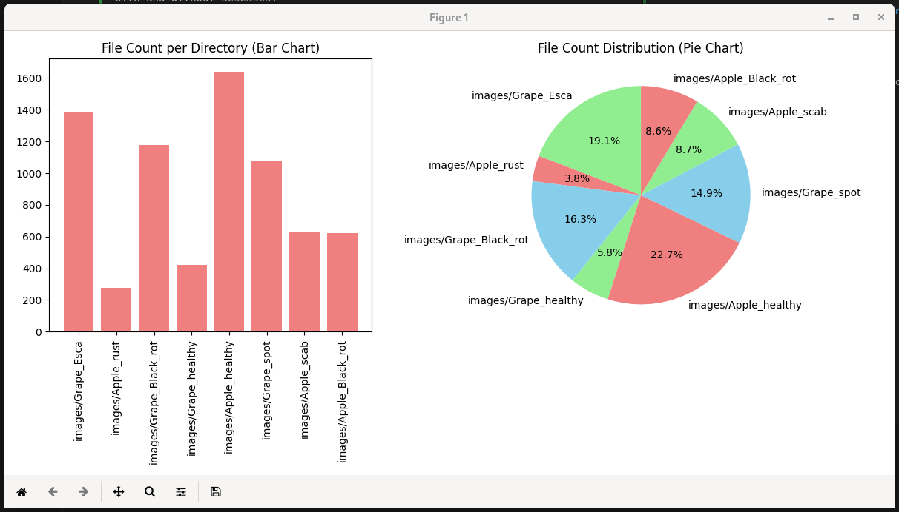
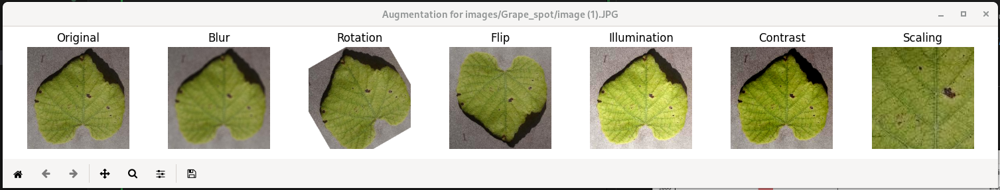
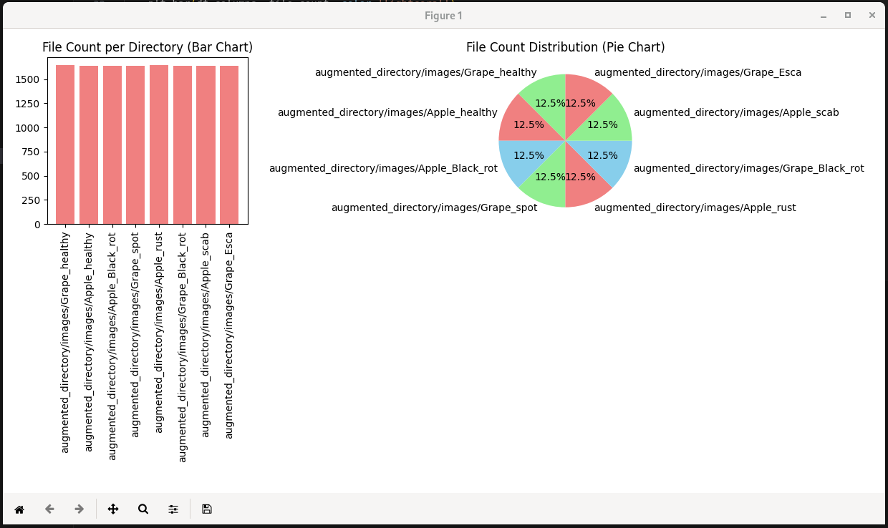
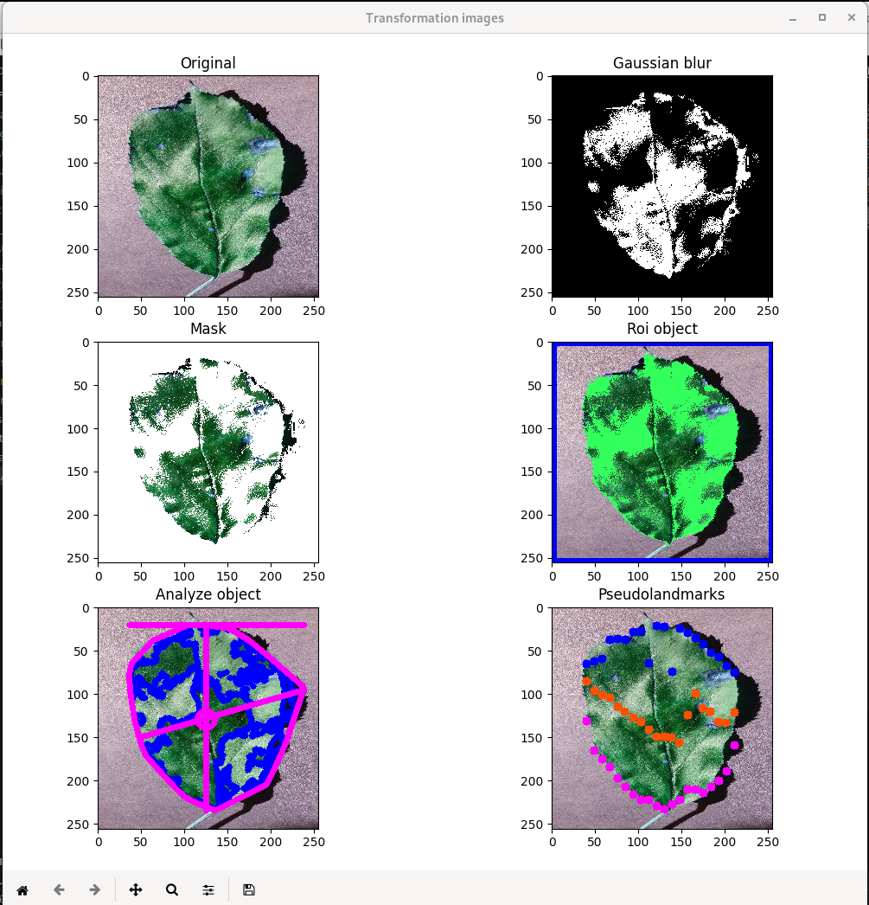
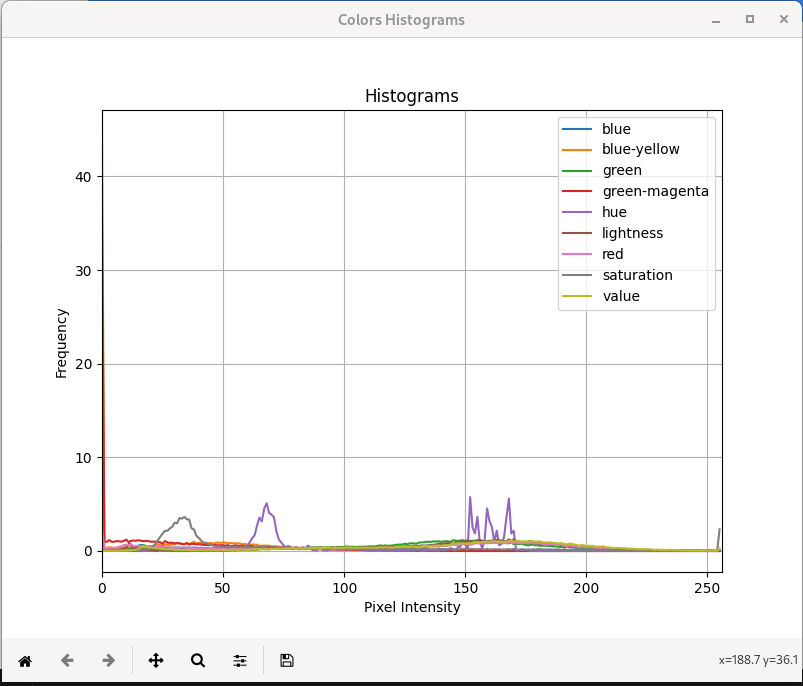

# Leaffliction

This 42 Machine Learning project aims to test Convolutional Neural Networks for computer vision. The project was done with [Pierrickjay](https://github.com/Pierrickjay)

The goal is to train a program to recognize photos of leaves with and without diseases.

The dataset can be downloaded from here: [leaves.zip](https://cdn.intra.42.fr/document/document/17547/leaves.zip)

## Distribution

The **Distribution.py** program illustrates how the dataset is distributed. For example:

```
?> python src/Distribution.py images
```



As observed, there is a need to balance the dataset by adding more images for some of the categories.

## Augmentation

The **Augmentation.py** program takes an image and modifies it to create six new images.

```
?> python src/Augmentation.py images/Grape_spot/image\ \(1\).JPG
```



The new images are saved in the same directory as the original.

Now, it is possible to balance the dataset using:

```
?> python src/Balance.py images
```

It will generate enough images to balance the dataset.



## Transformation

This section aims to transform the image to extract information from it. We initially utilized the plantCV library for most of the transformations. The 42 subject requested us to create transformations for the dataset that we could utilize to learn the characteristics of leaves. However, we ultimately decided not to use them and opted for a Convolutional Neural Network instead. The CNN autonomously learns the optimal filters and transformations to understand the data.

```
?>python src/Transformation.py images/Apple_Black_rot/image\ \(100\).JPG
```




## Training


The **Train.py** program utilizes the TensorFlow library to create a Convolutional Neural Network (CNN) with the following structure: 

```
model = Sequential([
    Conv2D(32, (3, 3), activation='relu', input_shape=(256, 256, 3)),
    MaxPooling2D((2, 2)),
    Conv2D(64, (3, 3), activation='relu'),
    MaxPooling2D((2, 2)),
    Conv2D(64, (3, 3), activation='relu'),
    MaxPooling2D((2, 2)),
    Conv2D(64, (3, 3), activation='relu'),
    MaxPooling2D((2, 2)),
    Flatten(),
    Dense(64, activation='relu',
            kernel_regularizer=regularizers.l2(0.1)),
    Dense(len(class_names), activation='softmax')
    ])
```

It uses Adam as the optimizer and SparseCategoricalCrossentropy as the loss function.

After numerous epochs, the accuracy was able to reach approximately 97% for the validation dataset. The model is saved in the **Learning.zip** file.

## Predict

The predict program takes an image, predicts its classification, and then displays the result.

