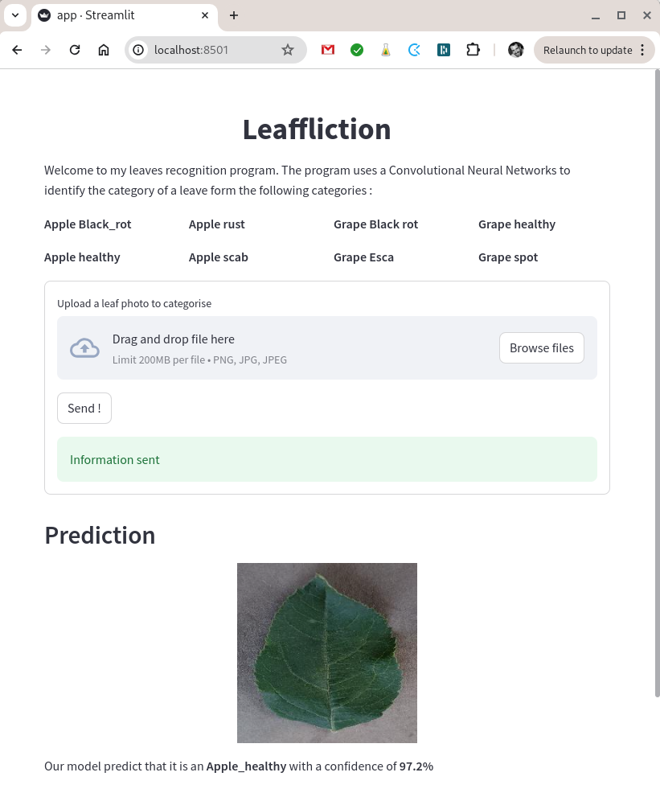

# Leaffliction

This Machine Learning project, done in collaboration with [Pierrickjay](https://github.com/Pierrickjay), aims to test the capabilities of Convolutional Neural Networks (CNNs) in the field of computer vision.

The primary goal is to train a program to accurately recognize and distinguish between images of healthy and diseased leaves.

The dataset for this project can be downloaded from here: [leaves.zip](https://cdn.intra.42.fr/document/document/17547/leaves.zip)

## Project Structure

- **Distribution**: This part of the program helps to analyze the dataset by visualizing the distribution of images available for training.
- **Augmentation**: If the dataset is unbalanced, it's crucial to increase the amount of data available by creating modified images.
- **Balance**: This program automatically creates augmented images for the categories with the least amount of data. Once this program is run, the dataset should be balanced.
- **Training**: This part of the program uses transfer learning from a TensorFlow CNN and fine-tunes it with our dataset.
- **Predict**: This function makes a prediction about the category of a given image.
- **Clean**: This function removes the augmented images from the dataset.

In addition to the original program, which can be run from the `backend_fastAPI/main.py` file, I've also created a front-end and an API to make the project more interactive and user-friendly.

The API is created using FastAPI, and the front-end is designed using Streamlit.

## Running the Original Program

The original program can be executed using the `main.py` file located in the `backend_fastAPI` directory. The program uses various command-line arguments to manage its functionalities:

- **--distribution** or **-d**: Launches the Distribution part of the program.
- **--augmentation** or **-a**: Launches the Augmentation part of the program.
- **--balance** or **-b**: Launches the Balance part of the program.
- **--train** or **-t**: Launches the Training part of the program.
- **--predict** or **-p**: Launches the Prediction part of the program.
- **--clean** or **-c**: Cleans the directory by removing the augmented images.
- **--load** or **-l**: Loads an existing model.

The `--load` option is necessary for the Train functionality if we wish to continue training an existing model.

*Distribution*


*Augmentation*


*Prediction*


The configuration options are available in the `backend_fastAPI/configs/CFG.py` file.

## Launching the Full Version (Front-end and Back-end)

To launch the full version of the project, which includes both the front-end and the back-end, use the following command:

```
docker compose -f ./docker-compose.yml up
```

Then, open your web browser and navigate to http://localhost:8501/ to start using the project.

